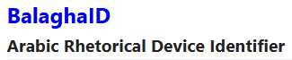

# [BalaghaID App (v0.1.0)](https://github.com/BalaghaID/App/tree/v0.1.0)
### Part of the [BALAGHA Score Project](https://project.balaghascore.com)

An interactive application for identifying Arabic rhetorical devices through guided decision-making.

&nbsp;
## 🔢 Changelog
🏷️ **2025-12-15 - [v0.1.0](https://github.com/BalaghaID/App/tree/v0.1.0) (First public release)**  
This is the first public, versioned release of the [BalaghaID](https://balagha-id.app) App as a fully-functioning self-contained HTML file.

&nbsp;   
---  
## 📬 About the Author
**[Dr Mandar Marathe](https://marathe.org)** | [SOAS Profile](https://www.soas.ac.uk/about/mandar-marathe)  
PhD Researcher in Arabic Rhetoric | SOAS University of London  
  

### Related Projects
- 📚 [Encyclopedia of Arabic Rhetoric](https://al-balagha.com) - Reference source for Arabic rhetorical devices  
- 💯 [BALAGHA Score](https://balaghascore.com) - Arabic rhetorical density analysis  
- 📖 [Balagha Corpus](https://balagha-corpus.com) - Annotated texts for Arabic rhetorical analysis  
- 📡 [BalaghaBase.org](https://balaghabase.org) - Semantic knowledge graph for Arabic rhetoric  
- 🔬 [Rhetorical Density](https://rhetorical-density.com) - Methodology and discussion of rhetorical density as a quantitative metric  

### Connect
    
---
_Last updated: 15 December 2025._  